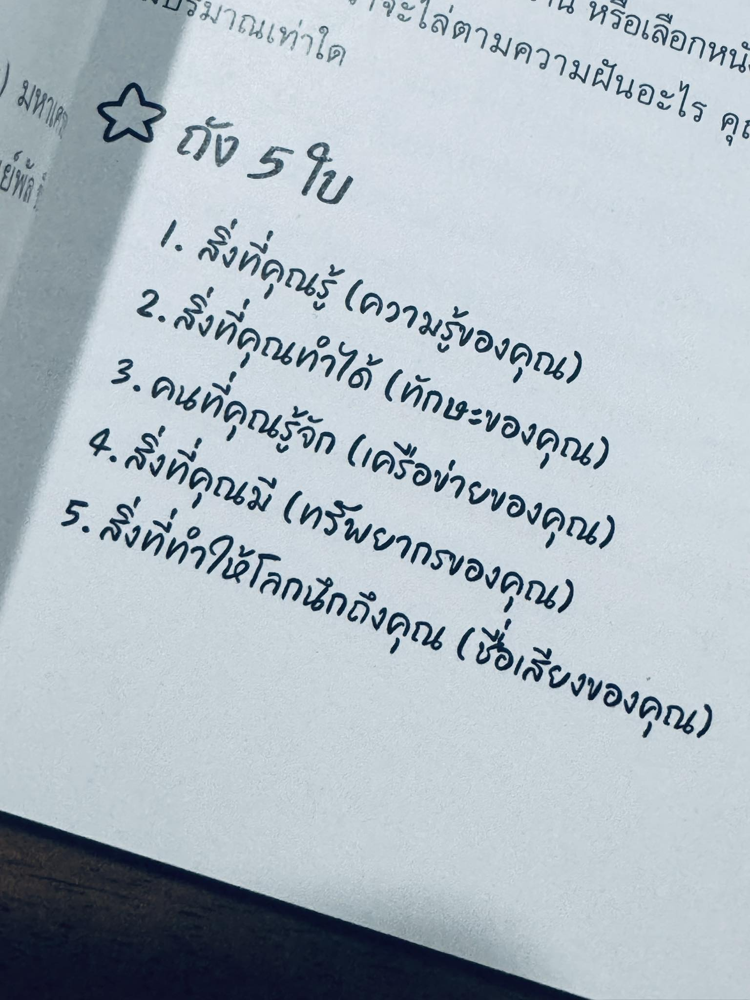

แน่นอนครับ นี่คือคำอธิบายอย่างละเอียดของแนวคิด "ถัง 5 ใบ" ตามที่ปรากฏในภาพ:

**แนวคิดหลัก: "ถัง 5 ใบ" (The 5 Buckets)**

แนวคิดนี้เป็นการเปรียบเทียบสินทรัพย์หรือทรัพยากรส่วนบุคคลที่สำคัญ 5 ประเภทเสมือน "ถัง" 5 ใบที่เราแต่ละคนมีอยู่ การทำความเข้าใจและประเมิน "ถัง" เหล่านี้จะช่วยให้เรารู้จักตัวเองดีขึ้น เห็นจุดแข็ง จุดที่ต้องพัฒนา และสามารถนำทรัพยากรเหล่านี้ไปใช้ประโยชน์ได้อย่างเต็มที่ ไม่ว่าจะเป็นเรื่องการทำงาน การแก้ปัญหา หรือการพัฒนาตนเอง

**คำอธิบายแต่ละ "ถัง":**

1.  **สิ่งที่คุณรู้ (ความรู้ของคุณ) - Bucket of Knowledge:**
    *   **หมายถึง:** ข้อมูล, ข้อเท็จจริง, ทฤษฎี, หลักการ, ความเข้าใจในเรื่องต่างๆ ที่คุณได้เรียนรู้และสั่งสมมา ไม่ว่าจะจากการศึกษาในระบบ, การอ่าน, การอบรม, หรือประสบการณ์ตรง
    *   **ความสำคัญ:** เป็นพื้นฐานในการคิดวิเคราะห์ ตัดสินใจ และแก้ปัญหา ความรู้ที่หลากหลายและลึกซึ้งเป็นสินทรัพย์ที่มีค่ามาก
    *   **ตัวอย่าง:** ความรู้ด้านประวัติศาสตร์, ความรู้ด้านการตลาดดิจิทัล, ความรู้ด้านการทำอาหาร, ความรู้ภาษาต่างประเทศ

2.  **สิ่งที่คุณทำได้ (ทักษะของคุณ) - Bucket of Skills:**
    *   **หมายถึง:** ความสามารถในการลงมือปฏิบัติจริง ความชำนาญที่เกิดจากการฝึกฝนจนทำได้ดี แบ่งได้เป็นทักษะเฉพาะทาง (Hard Skills) และทักษะทางสังคม (Soft Skills)
    *   **ความสำคัญ:** เป็นสิ่งที่แปลงความรู้ให้เกิดผลลัพธ์ที่เป็นรูปธรรม ทำให้คุณสามารถสร้างสรรค์ แก้ไข หรือจัดการสิ่งต่างๆ ได้
    *   **ตัวอย่าง:** ทักษะการเขียนโปรแกรม, ทักษะการเจรจาต่อรอง, ทักษะการนำเสนอ, ทักษะการเล่นดนตรี, ทักษะการบริหารจัดการเวลา

3.  **คนที่คุณรู้จัก (เครือข่ายของคุณ) - Bucket of Network:**
    *   **หมายถึง:** วงสังคมและเครือข่ายความสัมพันธ์ที่คุณมี ทั้งครอบครัว, เพื่อน, เพื่อนร่วมงาน, อาจารย์, ลูกค้า, ผู้ร่วมอุดมการณ์ หรือคนอื่นๆ ที่คุณติดต่อสื่อสารด้วย
    *   **ความสำคัญ:** เป็นแหล่งข้อมูล, การสนับสนุน, โอกาส, คำแนะนำ, และความช่วยเหลือ เครือข่ายที่ดีสามารถเปิดประตูไปสู่สิ่งต่างๆ ที่คุณอาจเข้าไม่ถึงด้วยตัวเอง
    *   **ตัวอย่าง:** เพื่อนที่แนะนำงานให้, รุ่นพี่ที่ให้คำปรึกษาเรื่องธุรกิจ, คนรู้จักที่ช่วยประสานงานให้, กลุ่มเพื่อนที่คอยให้กำลังใจ

4.  **สิ่งที่คุณมี (ทรัพยากรของคุณ) - Bucket of Resources:**
    *   **หมายถึง:** สินทรัพย์หรือปัจจัยสนับสนุนอื่นๆ นอกเหนือจาก 3 ข้อแรก ทั้งที่จับต้องได้และจับต้องไม่ได้
    *   **ความสำคัญ:** เป็นเครื่องมือหรือปัจจัยที่ช่วยให้คุณดำรงชีวิตหรือขับเคลื่อนเป้าหมายได้สะดวกขึ้น อาจเป็นตัวช่วยสำคัญในการลงมือทำสิ่งต่างๆ
    *   **ตัวอย่าง:** เงินทุน, ทรัพย์สิน (บ้าน, รถ), อุปกรณ์เครื่องมือ, เวลาว่าง, สุขภาพที่ดี, พลังงาน, การเข้าถึงเทคโนโลยีหรือแพลตฟอร์มต่างๆ

5.  **สิ่งที่ทำให้โลกนึกถึงคุณ (ชื่อเสียงของคุณ) - Bucket of Reputation:**
    *   **หมายถึง:** ภาพลักษณ์, ความน่าเชื่อถือ, การยอมรับ, หรือสิ่งที่คนอื่นนึกถึงเมื่อเอ่ยชื่อคุณ เป็นผลรวมของการกระทำ, คุณค่า, และปฏิสัมพันธ์ของคุณกับผู้อื่นที่สั่งสมมา
    *   **ความสำคัญ:** ชื่อเสียงที่ดีสร้างความไว้วางใจ เปิดโอกาส และทำให้คนอยากร่วมงานหรือสนับสนุนคุณ ในทางกลับกัน ชื่อเสียงที่ไม่ดีอาจเป็นอุปสรรคได้
    *   **ตัวอย่าง:** เป็นคนที่ได้ชื่อว่าตรงต่อเวลา, เป็นผู้เชี่ยวชาญที่น่าเชื่อถือในวงการ, เป็นคนใจกว้างชอบช่วยเหลือผู้อื่น, มีภาพลักษณ์เป็นผู้นำที่เก่ง

**สรุป:**

"ถัง 5 ใบ" นี้เป็นกรอบความคิด (Framework) ที่ช่วยให้เราสำรวจและตระหนักถึงสินทรัพย์ที่หลากหลายที่เรามีติดตัวอยู่ การหมั่นเติมและดูแล "ถัง" ทั้ง 5 ใบให้สมดุลและแข็งแรง จะช่วยเสริมสร้างศักยภาพและนำไปสู่ความสำเร็จและความสุขในด้านต่างๆ ของชีวิตได้ดียิ่งขึ้น